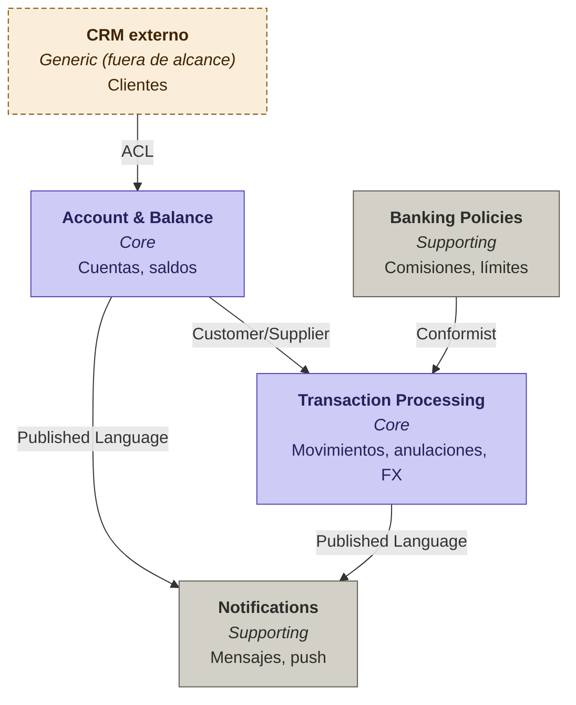

# Caso Resuelto — DDD aplicado a un Sistema Bancario

> **Curso:** Arquitectura de Software
> **Tema:** Domain-Driven Design + Event Storming
> **Dominio:** Banca digital (cuentas, transacciones, notificaciones)
> **Tipo:** Caso resuelto / solucionario

---

## Contexto del problema

Una institución bancaria necesita modelar el dominio central de su producto digital: **registro de cuentas**, **operaciones transaccionales** (movimientos, anulaciones, cambio de divisas), **notificaciones** a clientes y **políticas configurables** (comisiones, límites de seguridad).

Hay funcionalidades adyacentes que **quedan fuera del alcance** de esta iteración (registro de clientes, promociones, pagos de servicios, ahorro programado, etc.) y deben quedar **marcadas** sin perderse, porque podrían incorporarse después o consumirse desde sistemas externos.

> **Decisión de diseño global.** Como el contexto de cliente queda fuera del alcance, asumimos que `Cliente` viene de un **sistema upstream externo** (un CRM o IAM corporativo) y se consume como información de referencia.

---

## Paso 1 — Identificar eventos del dominio

| Paso | Acción | Personas | Finalidad |
|---|---|---|---|
| 1.0 | Reunión de equipo | Desarrollo + Negocio | Identificar eventos del dominio definidos en los requerimientos |

> **Nota pedagógica.** Los eventos se escriben en **pasado** porque representan **hechos consumados** del negocio. Comandos como "Registrar cuenta" no son eventos; el evento es `CuentaRegistrada` (el hecho de que la cuenta ya fue registrada).

### Eventos identificados

| # | Evento (en pasado) | Alcance | Notas / Justificación |
|---|---|---|---|
| 1 | `CuentaRegistrada` | Dentro | Alta de cuenta bancaria |
| 2 | `SaldoConsultado` | Dentro | Lectura del saldo |
| 3 | `SaldoVerificado` | Dentro | Verificación previa a una operación |
| 4 | `TransacciónIniciada` | Dentro | Comienza el ciclo de vida de una transacción |
| 5 | `TransacciónCompletada` | Dentro | Movimiento confirmado |
| 6 | `TransacciónAnulada` | Dentro | Reversión de una transacción |
| 7 | `CuentaDebitada` | Dentro | Lado débito de un movimiento |
| 8 | `CuentaAbonada` | Dentro | Lado crédito de un movimiento |
| 9 | `DivisaIntercambiada` | Dentro | Cambio entre soles y dólares |
| 10 | `ComisiónAplicada` | Dentro | Cobro de comisión sobre la transacción |
| 11 | `ComisiónConfigurada` | Dentro | Política de comisión actualizada |
| 12 | `LímiteDeMontoEstablecido` | Dentro | Tope por seguridad |
| 13 | `NotificaciónConfigurada` | Dentro | Preferencias del canal |
| 14 | `MensajeDeNotificaciónCreado` | Dentro | Construcción del payload |
| 15 | `NotificaciónEjecutada` | Dentro | Envío realizado |
| 16 | `MensajePushEnviado` | Dentro | Canal push |
| 17 | `CuentaDadaDeBaja` | Fuera | Fuera del alcance de los requerimientos |
| 18 | `CuentaDesactivada` | Fuera | Fuera del alcance |
| 19 | `ClienteRegistrado` | Fuera | Lo aporta el CRM externo |
| 20 | `ClienteActualizado` | Fuera | Lo aporta el CRM externo |
| 21 | `TipoDeCuentaRegistrado` | Fuera | Fuera del alcance |
| 22 | `PromociónMostrada` | Fuera | Fuera del alcance |
| 23 | `PagoDeServicioRealizado` | Fuera | Fuera del alcance |
| 24 | `MovimientosConsultadosPorPeriodo` | Fuera | Fuera del alcance |
| 25 | `PagoAutomáticoAfiliado` | Fuera | Fuera del alcance |
| 26 | `SeguroDeCuentaActivado` | Fuera | Fuera del alcance |
| 27 | `OperaciónFrecuenteRegistrada` | Fuera | Fuera del alcance |
| 28 | `AhorroProgramadoGestionado` | Fuera | Fuera del alcance |

---

## Paso 2 — Identificar subdominios

| Paso | Acción | Personas | Finalidad |
|---|---|---|---|
| 2.0 | Reunión de equipo | Desarrollo + Negocio | Agrupar eventos en subdominios |

### Subdominios identificados

| Subdominio | Tipo | Eventos asociados | Notas |
|---|---|---|---|
| **Gestión Básica de Cuentas** | Core | `CuentaRegistrada`, `SaldoConsultado`, `SaldoVerificado` | El corazón del producto: custodia del saldo |
| **Operaciones Bancarias** | Core | `TransacciónIniciada`, `TransacciónCompletada`, `TransacciónAnulada`, `CuentaDebitada`, `CuentaAbonada`, `DivisaIntercambiada`, `ComisiónAplicada` | Donde se gana dinero el banco |
| **Notificaciones** | Supporting | `MensajeDeNotificaciónCreado`, `NotificaciónEjecutada`, `MensajePushEnviado`, `NotificaciónConfigurada` | Habilita la experiencia, no diferencia el producto |
| **Seguridad Operacional** | Supporting | `LímiteDeMontoEstablecido` | Protección frente a fraude/error |
| **Configuración de Políticas** | Supporting | `ComisiónConfigurada` | Reglas paramétricas del negocio |
| Gestión de Clientes | — *(fuera de alcance)* | `ClienteRegistrado`, `ClienteActualizado` | Externalizado a un CRM upstream |
| Promociones y Productos | — *(fuera de alcance)* | `PromociónMostrada` | No es parte del MVP |

> **Decisión.** Tenemos **2 Core** y **3 Supporting**. La distinción Core/Supporting es clave para el Paso 5 — los Core merecen el modelo más rico y los equipos más expertos.

---

## Paso 3 — Lenguaje Ubicuo

| Paso | Acción | Personas | Finalidad |
|---|---|---|---|
| 3.0 | Reunión de equipo | Desarrollo + Negocio | Construir el glosario común del negocio |

### Glosario del negocio bancario

| Término | Definición | Estados | Reglas / Invariantes |
|---|---|---|---|
| **Cuenta Bancaria** | Producto financiero para guardar dinero a nombre de un cliente. | Activa, Desactivada, Bloqueada | Solo se permiten cuentas en soles y dólares |
| **Saldo** | Valor monetario disponible en una cuenta, actualizado por eventos como `FondosDepositados` y `FondosReservados`. | — | El saldo **no puede ser negativo** |
| **Transacción Bancaria** | Movimiento de dinero entre dos cuentas, con monto, origen/destino y motivo. | Iniciada, Reservada, Completada, Rechazada, Reversada | Requiere fondos suficientes en la cuenta origen |
| **Notificación Bancaria** | Mensaje generado por eventos de dominio, entregado por canal preferido del cliente. | Pendiente, Enviada, Fallida, Leída | Canales soportados: SMS, email, push |
| **Comisión** | Dinero que se descuenta de la cuenta origen en una transacción exitosa, como ganancia del banco. | — | Es constante = USD 5 *(parametrizable)* |
| **Cliente** | Identidad humana, dueña de una o más cuentas. *(Provisto por sistema externo)* | — | Un cliente puede tener una o más cuentas |
| **Límite Operativo** | Tope máximo de monto permitido para una operación, por motivos de seguridad. | Activo, Inactivo | Si se excede, la transacción se rechaza |
| **Moneda** | Unidad monetaria de una cuenta o transacción. | — | Solo `PEN` o `USD` en esta versión |

> **Nota pedagógica.** El Lenguaje Ubicuo **vive en el código**. Una clase llamada `CuentaBancaria.verificarFondos()` es DDD bien aplicado. Una clase `AccountManager.checkBalance()` rompe el modelo porque introduce vocabulario que el negocio no usa.

---

## Paso 4 — Modelo táctico

| Paso | Acción | Personas | Finalidad |
|---|---|---|---|
| 4.0 | Reunión de equipo | Desarrollo + Negocio | Identificar entidades, objetos de valor, agregados y relaciones |

### 4.A — Entidades

| Entidad | Atributos clave | Relaciones | Notas |
|---|---|---|---|
| **Cliente** | id, nombre, documento | 1 : N con `CuentaBancaria` | Identidad externa (CRM) |
| **CuentaBancaria** | número, moneda, estado | N : 1 con `Cliente`; 1 : N con `TransacciónBancaria` | Custodia el saldo |
| **TransacciónBancaria** | id, monto, origen, destino, motivo, estado | N : 2 con `CuentaBancaria` (origen, destino) | Hecho transaccional |
| **Saldo** | monto, moneda | 1 : 1 con `CuentaBancaria` | Parte del agregado Cuenta |
| **Comisión** | monto, moneda | N : 1 con `TransacciónBancaria` | Aplicada al confirmar |
| **NotificaciónBancaria** | id, canal, contenido, estado | N : 1 con `Cliente` | Mensaje a entregar |

### 4.B — Objetos de Valor

| Objeto de Valor | Atributos | Descripción / Uso |
|---|---|---|
| **Dinero** | monto, moneda | Representa una cantidad monetaria. Usado en saldos, transacciones, comisiones. |
| **Moneda** | código (`PEN` / `USD`) | Unidad monetaria. Inmutable. |
| **NúmeroDeCuenta** | string (formato CCI) | Identificador estable de una cuenta. |
| **CanalNotificación** | tipo (`sms` / `email` / `push`) | Medio por el cual se entrega la notificación. |
| **LímiteMonto** | monto, moneda, ventana temporal | Tope operativo por seguridad. |

### 4.C — Agregados

| Agregado (raíz) | Miembros incluidos | Invariantes |
|---|---|---|
| **CuentaBancaria** | `Saldo`, `NúmeroDeCuenta`, `Moneda` | Saldo ≥ 0; solo la cuenta puede modificar su saldo; moneda inmutable después de creada |
| **TransacciónBancaria** | `Dinero`, `Comisión` | Estado sigue máquina (Iniciada → Reservada → Completada / Rechazada / Reversada); monto > 0; origen ≠ destino |
| **NotificaciónBancaria** | `CanalNotificación`, contenido | Una notificación pendiente debe tener canal y destinatario válidos |
| **PolíticaDeComisión** | tarifa base, moneda | Una comisión vigente por moneda en un momento dado |
| **PolíticaDeLímite** | `LímiteMonto`, ámbito | Un límite vigente por ámbito (cliente, canal, etc.) en un momento dado |

> **Regla de oro de agregados.** Una transacción **NO modifica directamente** el saldo de la cuenta — le envía un comando ("reservar fondos") y la cuenta responde con un evento (`FondosReservados` o `FondosInsuficientes`). Eso preserva la consistencia.

---

## Paso 5 — Bounded Contexts + Context Map (Opción C)

| Paso | Acción | Personas | Finalidad |
|---|---|---|---|
| 5.0 | Reunión de equipo | Desarrollo + Negocio | Delimitar Bounded Contexts y trazar el Context Map |

> **Decisión.** Adoptamos la **Opción C — Híbrida pragmática (4 BCs)**: respeta el modelo de agregados del Paso 4 sin caer en fragmentación excesiva. Apropiada para 2-3 squads.

### 5.A — Lista de Bounded Contexts

| Bounded Context | Tipo | Agregado(s) raíz | Eventos / Acciones que cubre | Subdominios absorbidos |
|---|---|---|---|---|
| **Account & Balance** | Core | `CuentaBancaria` (con `Saldo`) | `CuentaRegistrada`, `SaldoConsultado`, `SaldoVerificado`, `FondosReservados` | Gestión Básica de Cuentas |
| **Transaction Processing** | Core | `TransacciónBancaria` | `TransacciónIniciada`, `TransacciónCompletada`, `TransacciónAnulada`, `CuentaDebitada`, `CuentaAbonada`, `DivisaIntercambiada`, `ComisiónAplicada` | Operaciones Bancarias |
| **Notifications** | Supporting | `NotificaciónBancaria` | `MensajeDeNotificaciónCreado`, `NotificaciónEjecutada`, `MensajePushEnviado`, `NotificaciónConfigurada` | Notificaciones |
| **Banking Policies** | Supporting | `PolíticaDeComisión`, `PolíticaDeLímite` | `ComisiónConfigurada`, `LímiteDeMontoEstablecido` | Configuración de Políticas + Seguridad Operacional |

### 5.B — Context Map (relaciones)

| Upstream (provee) | Downstream (consume) | Patrón | Qué se intercambia | Notas |
|---|---|---|---|---|
| Account & Balance | Transaction Processing | **Customer / Supplier** | Comando `reservarFondos`, evento `FondosReservados` / `FondosInsuficientes` | La transacción es cliente del saldo; la cuenta sigue siendo dueña de su consistencia |
| Banking Policies | Transaction Processing | **Conformist** | Tarifa de comisión vigente; límite operativo aplicable | Transaction lee la configuración tal cual, sin traducirla |
| Transaction Processing | Notifications | **Published Language** | Eventos: `TransacciónCompletada`, `TransacciónAnulada`, `LímiteExcedido` | Bus de eventos / pub-sub |
| Account & Balance | Notifications | **Published Language** | Eventos: `CuentaRegistrada`, `SaldoBajo` | Bus de eventos / pub-sub |
| CRM externo *(fuera de alcance)* | Account & Balance | **Anti-Corruption Layer** | Información de `Cliente` | Se traduce el modelo del CRM al modelo interno de cliente |

### 5.C — Diagrama del Context Map

### 5.D — Glosario de patrones (referencia rápida)

| Patrón | Cuándo aplica |
|---|---|
| **Partnership** | Dos contextos colaboran estrechamente y evolucionan juntos. |
| **Shared Kernel** | Comparten un subconjunto del modelo. Cambios requieren acuerdo. |
| **Customer / Supplier** | Upstream prioriza necesidades del downstream. |
| **Conformist** | Downstream adopta el modelo del upstream tal cual. |
| **Anti-Corruption Layer (ACL)** | Downstream traduce el modelo upstream para protegerse. |
| **Open Host Service (OHS)** | Upstream expone una API estándar para múltiples consumidores. |
| **Published Language** | Lenguaje común publicado (eventos de dominio). |
| **Separate Ways** | Sin integración. |

---

## Discusión final — Por qué Opción C

Se evaluaron tres alternativas durante el ejercicio:

| Opción | # de BCs | Cuándo conviene |
|---|---|---|
| **A** — Alineada 1:1 con subdominios | 5 | Equipos grandes (4+ squads), alta tasa de cambio en políticas |
| **B** — Consolidada | 3 | Equipo único, MVP rápido |
| **C** — Híbrida pragmática | **4** | **2-3 squads, balance entre cohesión y simplicidad** ✅ |

**Por qué C ganó:**

1. **Respeta los agregados** del Paso 4 — `CuentaBancaria` y `TransacciónBancaria` quedan en contextos separados, evitando un monolito.
2. **Une Seguridad + Configuración** en `Banking Policies` porque ambos son **reglas paramétricas** del negocio y comparten el mismo perfil de cambio.
3. **Notifications queda aislado** — es Supporting y reacciona a eventos, lo que permite escalarlo o reemplazarlo independientemente.
4. **El cambio de divisas (FX) queda dentro de Transaction** — si en el futuro se integra un proveedor externo de tipos de cambio, se puede extraer como un 5° BC con ACL.

---

## Anexo — Decisiones clave registradas

| # | Decisión | Justificación |
|---|---|---|
| 1 | `Cliente` viene de un sistema externo | Está fuera del alcance del MVP |
| 2 | Comisión modelada como agregado `PolíticaDeComisión`, no atributo de cuenta | La política cambia independientemente |
| 3 | Cambio de divisas absorbido en `Transaction Processing` | Volumen bajo en MVP, sin proveedor externo aún |
| 4 | Notifications consume eventos vía Published Language | Desacopla productores de consumidores |
| 5 | `Banking Policies` es Conformist (no ACL) frente a Transaction | El modelo de políticas es simple y estable; no requiere traducción |
