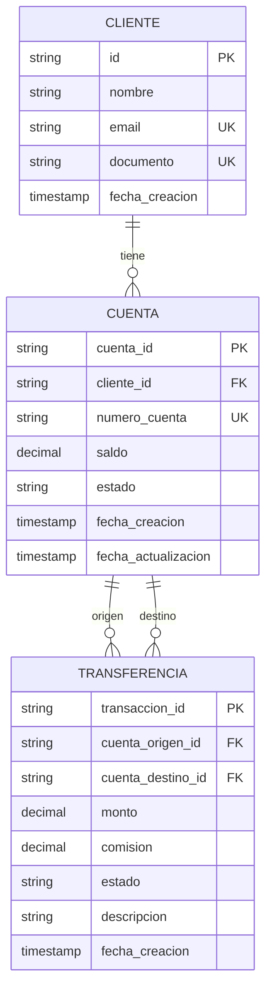
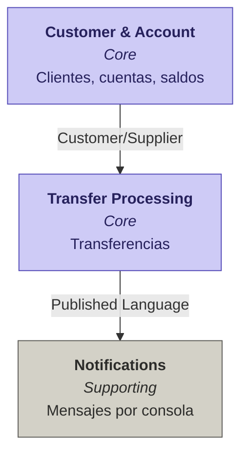

# Caso Resuelto — DDD aplicado a *Banco Digital*

> **Curso:** Arquitectura de Software
> **Tema:** Domain-Driven Design + Event Storming
> **Dominio:** Banco Digital (versión simplificada)
> **Tipo:** Caso resuelto / solucionario

---

## Contexto del problema

Desarrollar **Banco Digital**, un sistema bancario simple que permita crear cuentas bancarias y transferir dinero entre ellas, con una notificación básica al cliente.

### Requisitos funcionales

1. **Gestión Básica de Cuentas**
   - Crear cuenta (nombre, saldo inicial)
   - Consultar saldo
2. **Operación Principal**
   - Transferir dinero entre cuentas
   - Validar saldo suficiente
3. **Notificación Simple**
   - Notificar al cliente después de una transferencia
   - Soportar 1 canal (consola)

> **Decisión de diseño global.** El alcance es deliberadamente minimalista. Modelaremos solo lo necesario para cumplir los tres requisitos. Extensiones futuras (múltiples monedas, comisiones configurables, canales adicionales, anulaciones) quedan documentadas pero **fuera** del Paso 5.

---

## Paso 1 — Identificar eventos del dominio

| Paso | Acción | Personas | Finalidad |
|---|---|---|---|
| 1.0 | Reunión de equipo | Desarrollo + Negocio | Identificar eventos del dominio según los requerimientos |

> **Nota pedagógica.** Aunque el requisito habla de "crear cuenta" o "transferir", esos son **comandos**. El evento es lo que **ya ocurrió**: `CuentaCreada`, `TransferenciaCompletada`. Esa distinción es la esencia de Event Storming.

### Eventos identificados

| # | Evento (en pasado) | Alcance | Notas / Justificación |
|---|---|---|---|
| 1 | `ClienteRegistrado` | Dentro | Requerido implícitamente: la cuenta se crea a nombre de un cliente |
| 2 | `CuentaCreada` | Dentro | Requisito 1: crear cuenta con nombre y saldo inicial |
| 3 | `SaldoConsultado` | Dentro | Requisito 1: consultar saldo |
| 4 | `TransferenciaIniciada` | Dentro | Inicio del flujo del Requisito 2 |
| 5 | `SaldoVerificado` | Dentro | Requisito 2: validar saldo suficiente |
| 6 | `FondosReservados` | Dentro | Lado interno: cuenta origen confirma que tiene fondos |
| 7 | `CuentaDebitada` | Dentro | Cuenta origen pierde monto |
| 8 | `CuentaAbonada` | Dentro | Cuenta destino recibe monto |
| 9 | `TransferenciaCompletada` | Dentro | Resultado exitoso de la operación |
| 10 | `TransferenciaFallida` | Dentro | Saldo insuficiente o cuenta inválida |
| 11 | `NotificaciónEnviada` | Dentro | Requisito 3: notificar al cliente por consola |
| 12 | `CuentaCerrada` | Fuera | No es parte del MVP |
| 13 | `ComisiónConfigurada` | Fuera | Comisión queda como constante (ver E/R) |
| 14 | `TransferenciaAnulada` | Fuera | No es parte del MVP, aunque el estado "CANCELADA" existe en el E/R |
| 15 | `NotificaciónPorEmailEnviada` | Fuera | Solo canal consola |

---

## Paso 2 — Identificar subdominios

| Paso | Acción | Personas | Finalidad |
|---|---|---|---|
| 2.0 | Reunión de equipo | Desarrollo + Negocio | Agrupar eventos en subdominios |

### Subdominios identificados

| Subdominio | Tipo | Eventos asociados | Notas |
|---|---|---|---|
| **Gestión de Clientes y Cuentas** | Core | `ClienteRegistrado`, `CuentaCreada`, `SaldoConsultado`, `SaldoVerificado`, `FondosReservados` | Es el corazón: custodia identidad del cliente y del saldo |
| **Procesamiento de Transferencias** | Core | `TransferenciaIniciada`, `CuentaDebitada`, `CuentaAbonada`, `TransferenciaCompletada`, `TransferenciaFallida` | Donde el sistema "hace su trabajo" |
| **Notificaciones** | Supporting | `NotificaciónEnviada` | Apoya la experiencia, no diferencia el producto |

> **Decisión.** Con solo 3 subdominios y 2 de ellos Core, queda claro dónde irá la mayor inversión de modelado y testing.

---

## Paso 3 — Lenguaje Ubicuo

| Paso | Acción | Personas | Finalidad |
|---|---|---|---|
| 3.0 | Reunión de equipo | Desarrollo + Negocio | Construir el glosario común del negocio |

### Glosario del negocio

| Término | Definición | Estados | Reglas / Invariantes |
|---|---|---|---|
| **Cliente** | Persona dueña de una o más cuentas. Identificada por documento y email. | — | Email único; documento único |
| **Cuenta** | Producto financiero que guarda el dinero de un cliente. | `ACTIVO`, `CERRADO` | Saldo nunca puede ser negativo |
| **Saldo** | Cantidad de dinero disponible en una cuenta en un momento dado. | — | Se actualiza únicamente por `CuentaDebitada` o `CuentaAbonada` |
| **Transferencia** | Movimiento de dinero entre dos cuentas. | `PENDIENTE`, `COMPLETADA`, `FALLIDA` | Monto > 0; origen ≠ destino; requiere fondos suficientes |
| **Comisión** | Costo fijo cobrado a la cuenta origen en cada transferencia. | — | Constante = USD 5 *(según el E/R)* |
| **Notificación** | Mensaje informativo al cliente tras una transferencia. | `ENVIADA` | Canal único: consola |

> **Nota pedagógica.** Este glosario **vive en el código**. Si en el código aparece `AccountService.checkAmount()` en lugar de `Cuenta.verificarFondos()`, se rompió el Lenguaje Ubicuo.

---

## Paso 4 — Modelo táctico

| Paso | Acción | Personas | Finalidad |
|---|---|---|---|
| 4.0 | Reunión de equipo | Desarrollo + Negocio | Identificar entidades, objetos de valor, agregados y relaciones |

### 4.A — Entidades

| Entidad | Atributos clave | Relaciones | Notas |
|---|---|---|---|
| **Cliente** | `id`, `nombre`, `email`, `documento` | 1 : N con `Cuenta` | Raíz de su propio agregado |
| **Cuenta** | `cuenta_id`, `numero_cuenta`, `saldo`, `estado` | N : 1 con `Cliente`; 1 : N con `Transferencia` | Raíz de su agregado, custodia el saldo |
| **Transferencia** | `transaccion_id`, `monto`, `comisión`, `estado` | N : 2 con `Cuenta` (origen, destino) | Hecho transaccional |

### 4.B — Objetos de Valor

| Objeto de Valor | Atributos | Descripción / Uso |
|---|---|---|
| **Dinero** | `monto`, `moneda` | Representa una cantidad monetaria. Inmutable. |
| **NúmeroDeCuenta** | `string` (formato banco) | Identificador externo y estable de una cuenta |
| **Email** | `string` validado | Identificador de contacto del cliente |
| **Documento** | `string` | Identificación oficial del cliente |

### 4.C — Agregados

| Agregado (raíz) | Miembros incluidos | Invariantes |
|---|---|---|
| **Cliente** | `Email`, `Documento`, `Nombre` | Email y documento únicos en el sistema |
| **Cuenta** | `Saldo` (`Dinero`), `NúmeroDeCuenta`, estado | Saldo ≥ 0; solo la cuenta puede modificar su saldo; estado válido (`ACTIVO` o `CERRADO`) |
| **Transferencia** | `Dinero` (monto), `Comisión`, estado | Monto > 0; origen ≠ destino; estado sigue máquina: `PENDIENTE` → `COMPLETADA` o `FALLIDA` |

> **Regla de oro de agregados.** La `Transferencia` **no modifica directamente** el saldo de la `Cuenta`. Le envía un comando (`reservarFondos`) y la cuenta responde con un evento (`FondosReservados` o `TransferenciaFallida`). Eso preserva la consistencia de cada agregado.

### 4.D — Diagrama E/R derivado del modelo táctico

> Cada agregado raíz típicamente se materializa como una tabla. Los objetos de valor pueden vivir como columnas dentro de la tabla del agregado que los contiene.



---

## Paso 5 — Bounded Contexts + Context Map

| Paso | Acción | Personas | Finalidad |
|---|---|---|---|
| 5.0 | Reunión de equipo | Desarrollo + Negocio | Delimitar Bounded Contexts y trazar el Context Map |

> **Decisión.** Para este alcance simplificado, **3 Bounded Contexts** son suficientes y dejan margen para crecer. Si el sistema sumara políticas configurables o múltiples canales de notificación, esos contextos podrían dividirse.

### 5.A — Lista de Bounded Contexts

| Bounded Context | Tipo | Agregado(s) raíz | Eventos / Acciones que cubre | Subdominios absorbidos |
|---|---|---|---|---|
| **Customer & Account** | Core | `Cliente`, `Cuenta` (con `Saldo`) | `ClienteRegistrado`, `CuentaCreada`, `SaldoConsultado`, `SaldoVerificado`, `FondosReservados` | Gestión de Clientes y Cuentas |
| **Transfer Processing** | Core | `Transferencia` | `TransferenciaIniciada`, `CuentaDebitada`, `CuentaAbonada`, `TransferenciaCompletada`, `TransferenciaFallida` | Procesamiento de Transferencias |
| **Notifications** | Supporting | `Notificación` | `NotificaciónEnviada` | Notificaciones |

### 5.B — Context Map (relaciones)

| Upstream (provee) | Downstream (consume) | Patrón | Qué se intercambia | Notas |
|---|---|---|---|---|
| Customer & Account | Transfer Processing | **Customer / Supplier** | Comando `reservarFondos`; eventos `FondosReservados` / `FondosInsuficientes` | La transferencia es cliente del saldo; la cuenta es dueña de su consistencia |
| Transfer Processing | Notifications | **Published Language** | Evento `TransferenciaCompletada` (con cliente, monto, fecha) | Bus de eventos; Notifications no conoce a Transfer, solo el contrato del evento |

### 5.C — Diagrama del Context Map



### 5.D — Glosario de patrones (referencia rápida)

| Patrón | Cuándo aplica |
|---|---|
| **Partnership** | Dos contextos colaboran estrechamente y evolucionan juntos. |
| **Shared Kernel** | Comparten un subconjunto del modelo. Cambios requieren acuerdo. |
| **Customer / Supplier** | Upstream prioriza necesidades del downstream. |
| **Conformist** | Downstream adopta el modelo del upstream tal cual. |
| **Anti-Corruption Layer (ACL)** | Downstream traduce el modelo upstream para protegerse. |
| **Open Host Service (OHS)** | Upstream expone una API estándar para múltiples consumidores. |
| **Published Language** | Lenguaje común publicado (eventos de dominio). |
| **Separate Ways** | Sin integración. |

---

## Discusión — Por qué 3 BCs y no más

Para este alcance se evaluaron tres alternativas durante el ejercicio:

| Opción | # de BCs | Cuándo conviene |
|---|---|---|
| **A** — Monolito de un solo BC | 1 | MVP de una sola tarde; sin equipo separado |
| **B** — 3 BCs *(elegido)* | **3** | **MVP con notificaciones desacopladas; 1-2 squads** ✅ |
| **C** — 4+ BCs con Policies y Security separados | 4+ | Cuando comisiones y límites se vuelven configurables |

**Por qué B ganó:**

1. **Respeta los 3 agregados** del Paso 4 — Cliente/Cuenta queda junto porque comparten ciclo de vida; Transferencia es claramente otro contexto.
2. **Notifications aislado** — aunque el canal hoy sea solo consola, mantenerlo separado permite agregar email/SMS sin tocar el core.
3. **No hay políticas configurables aún** — la comisión es constante ($5), no merece un BC propio.
4. **Está alineado con cómo crecería el sistema** — si mañana se agregan préstamos o tarjetas, cada uno sería un BC nuevo sin tocar los actuales.

---

## Anexo A — Trazabilidad DDD ↔ E/R ↔ SQL

| Agregado DDD | Tabla SQL | Notas de persistencia |
|---|---|---|
| `Cliente` | `cliente` | Email y documento se persisten como columnas con UNIQUE; serían VOs en código |
| `Cuenta` | `cuenta` | Saldo es VO `Dinero` en código, pero se persiste como `DECIMAL(15,2)` |
| `Transferencia` | `transaccion` | La tabla mantiene el nombre técnico "transaccion"; en el modelo de dominio es `Transferencia` (Lenguaje Ubicuo) |

> **Punto de discusión en clase.** La tabla se llama `transaccion` y el agregado se llama `Transferencia`. ¿Está bien? Argumento a favor: la BD es un detalle técnico, el modelo de dominio prima. Argumento en contra: forzar nombres distintos crea fricción de mantenimiento. Una mejora sería renombrar la tabla a `transferencia` para alinear ambos.

## Anexo B — Decisiones clave registradas

| # | Decisión | Justificación |
|---|---|---|
| 1 | `Cliente` queda dentro del modelo (no externo) | El E/R lo modela como tabla propia |
| 2 | `Cliente` y `Cuenta` son agregados separados, en el mismo BC | Tienen ciclos de vida distintos pero el negocio los gestiona juntos |
| 3 | Comisión queda como atributo del agregado `Transferencia` | Es constante en el MVP; no merece agregado propio |
| 4 | Estado `CANCELADA` del E/R queda fuera del MVP | El requisito no menciona anulación; se documenta como evolución futura |
| 5 | Único canal de notificación: consola | Requisito explícito del problema |
| 6 | Transferencia y Cuenta se integran como Customer/Supplier | La cuenta debe seguir siendo dueña de su saldo |

---

## Anexo C — Pistas para la implementación (opcional)

Si el ejercicio sigue hasta código, una estructura limpia respetando los BCs sería:

```
src/
├── customer_account/        # BC: Customer & Account
│   ├── domain/
│   │   ├── Cliente.java
│   │   ├── Cuenta.java
│   │   └── Saldo.java
│   └── application/
│       └── CuentaService.java
├── transfer/                # BC: Transfer Processing
│   ├── domain/
│   │   ├── Transferencia.java
│   │   └── Comision.java
│   └── application/
│       └── TransferenciaService.java
└── notifications/           # BC: Notifications
    ├── domain/
    │   └── Notificacion.java
    └── infrastructure/
        └── ConsoleChannel.java
```

Los BCs **no se llaman entre sí por referencia directa** — se comunican vía eventos de dominio o interfaces de aplicación bien delimitadas.
