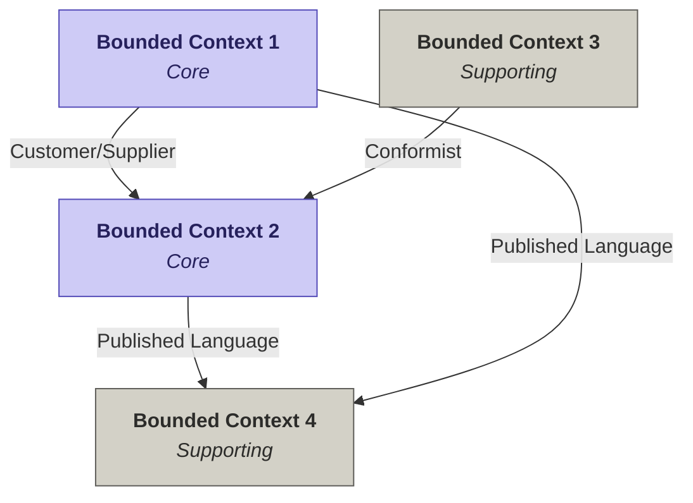

# Plantilla DDD con Event Storming

> **Curso:** Arquitectura de Software
> **Sesión / Tema:** _______________________________________________
> **Equipo / Grupo:** ______________________________________________
> **Fecha:** _______________________________________________________

---

## Objetivo de la sesión

Aplicar **Domain-Driven Design (DDD)** mediante una sesión de **Event Storming** colaborativa entre el equipo de desarrollo y los expertos del negocio, modelando un dominio desde los eventos hasta los **Bounded Contexts** y su **Context Map**.

## Convenciones

- Eventos siempre en **pasado**: `CuentaRegistrada`, `PedidoConfirmado`, `PagoRechazado`.
- Marcar explícitamente lo que queda **Fuera del alcance** — no se borra, se etiqueta.
- Si surge una palabra nueva en cualquier paso, agrégala al **Lenguaje Ubicuo** (Paso 3).
- Un **Bounded Context** puede absorber **uno o varios subdominios** — no son lo mismo.
- **Subdominio** = parte del problema. **Bounded Context** = parte de la solución.

## Roles en la sesión

| Rol | Responsabilidad |
|---|---|
| **Facilitador** | Conduce la sesión, asegura que cada paso se cierre antes de avanzar |
| **Domain Expert** | Aporta el conocimiento del negocio, valida vocabulario y reglas |
| **Arquitecto / Dev** | Traduce el modelo a decisiones técnicas (agregados, contextos) |
| **Estudiantes** | Documentan, proponen y debaten |

---

## Paso 1 — Identificar eventos del dominio

| Paso | Acción | Personas | Finalidad |
|---|---|---|---|
| 1.0 | Reunión de equipo | Desarrollo + Negocio | Identificar eventos del dominio definidos en los requerimientos |

> **Instrucción.** Lista todos los eventos del dominio en **tiempo pasado** (algo que ya ocurrió). Marca el alcance: `Dentro` si está en los requerimientos, `Fuera` si queda fuera. Justifica en notas.

### Eventos identificados

| # | Evento (en pasado) | Alcance | Notas / Justificación |
|---|---|---|---|
| 1 |  |  |  |
| 2 |  |  |  |
| 3 |  |  |  |
| 4 |  |  |  |
| 5 |  |  |  |
| 6 |  |  |  |
| 7 |  |  |  |
| 8 |  |  |  |
| 9 |  |  |  |
| 10 |  |  |  |

---

## Paso 2 — Identificar subdominios

| Paso | Acción | Personas | Finalidad |
|---|---|---|---|
| 2.0 | Reunión de equipo | Desarrollo + Negocio | Agrupar eventos en subdominios |

> **Instrucción.** Agrupa los eventos del Paso 1 en subdominios (áreas coherentes del negocio). Clasifica cada uno:
>
> - **Core** → ventaja competitiva del producto.
> - **Supporting** → apoya al Core, pero no diferencia el producto.
> - **Generic** → commodity, podría comprarse o externalizarse.

### Subdominios identificados

| Subdominio | Tipo | Eventos asociados | Notas |
|---|---|---|---|
|  |  |  |  |
|  |  |  |  |
|  |  |  |  |
|  |  |  |  |
|  |  |  |  |

---

## Paso 3 — Lenguaje Ubicuo (Ubiquitous Language)

| Paso | Acción | Personas | Finalidad |
|---|---|---|---|
| 3.0 | Reunión de equipo | Desarrollo + Negocio | Construir el glosario común del negocio |

> **Instrucción.** Define cada término en **lenguaje del negocio** (no técnico). Incluye los estados que puede tomar y las reglas/invariantes que aplican. Este glosario debe ser compartido y respetado por todos los pasos siguientes y por el código.

### Glosario del negocio

| Término | Definición | Estados | Reglas / Invariantes |
|---|---|---|---|
|  |  |  |  |
|  |  |  |  |
|  |  |  |  |
|  |  |  |  |
|  |  |  |  |
|  |  |  |  |

---

## Paso 4 — Modelo táctico

| Paso | Acción | Personas | Finalidad |
|---|---|---|---|
| 4.0 | Reunión de equipo | Desarrollo + Negocio | Identificar entidades, objetos de valor, agregados y relaciones |

### 4.A — Entidades

> **Entidad** = objeto con **identidad propia** que persiste en el tiempo. Indica atributos clave y con qué otras entidades se relaciona.

| Entidad | Atributos clave | Relaciones | Notas |
|---|---|---|---|
|  |  |  |  |
|  |  |  |  |
|  |  |  |  |

### 4.B — Objetos de Valor

> **Objeto de Valor (Value Object)** = se define por sus atributos, **no tiene identidad propia**, es **inmutable**. Ejemplos típicos: `Dinero`, `Moneda`, `Dirección`, `RangoDeFechas`.

| Objeto de Valor | Atributos | Descripción / Uso |
|---|---|---|
|  |  |  |
|  |  |  |
|  |  |  |

### 4.C — Agregados

> **Agregado** = grupo de entidades/VO tratados como una **unidad de consistencia**. Solo se accede al agregado a través de su **raíz**. Define las **invariantes** que el agregado debe garantizar.

| Agregado (raíz) | Miembros incluidos | Invariantes |
|---|---|---|
|  |  |  |
|  |  |  |
|  |  |  |

---

## Paso 5 — Bounded Contexts + Context Map

| Paso | Acción | Personas | Finalidad |
|---|---|---|---|
| 5.0 | Reunión de equipo | Desarrollo + Negocio | Delimitar Bounded Contexts y trazar el Context Map |

### 5.A — Lista de Bounded Contexts

> **Bounded Context** = frontera dentro de la cual un modelo es **consistente**. Puede absorber uno o varios subdominios. Clasifícalo como Core / Supporting / Generic según el subdominio principal que cubra.

| Bounded Context | Tipo | Agregado(s) raíz | Eventos / Acciones que cubre | Subdominios absorbidos |
|---|---|---|---|---|
|  |  |  |  |  |
|  |  |  |  |  |
|  |  |  |  |  |
|  |  |  |  |  |

### 5.B — Context Map (relaciones)

> **Instrucción.** Para cada par de contextos que se integran, indica el patrón. El **Upstream** provee/publica; el **Downstream** consume/depende. Ver glosario en 5.D.

| Upstream (provee) | Downstream (consume) | Patrón | Qué se intercambia | Notas |
|---|---|---|---|---|
|  |  |  |  |  |
|  |  |  |  |  |
|  |  |  |  |  |
|  |  |  |  |  |

### 5.C — Diagrama del Context Map

> **Instrucción.** Edita el diagrama Mermaid con los nombres de tus contextos y patrones reales. Renderiza en GitHub, VS Code, Obsidian, Notion, etc.

### 5.D — Glosario de patrones de integración (referencia)

| Patrón | Cuándo aplica |
|---|---|
| **Partnership** | Dos contextos colaboran estrechamente y evolucionan juntos. Mismo destino. |
| **Shared Kernel** | Comparten un subconjunto del modelo. Cambios requieren acuerdo de ambos equipos. |
| **Customer / Supplier** | Upstream prioriza necesidades del downstream. Relación de servicio. |
| **Conformist** | Downstream adopta el modelo del upstream tal cual, sin traducción. |
| **Anti-Corruption Layer (ACL)** | Downstream traduce el modelo upstream para protegerse de su forma. |
| **Open Host Service (OHS)** | Upstream expone una API estándar pensada para múltiples consumidores. |
| **Published Language** | Lenguaje común publicado (ej. eventos de dominio en un bus). |
| **Separate Ways** | Sin integración. Cada contexto resuelve por su cuenta. |

---

## Checklist de cierre

- [ ] Todos los eventos están en pasado.
- [ ] Lo fuera de alcance está marcado, no borrado.
- [ ] Cada subdominio tiene tipo (Core / Supporting / Generic).
- [ ] El glosario está consensuado con negocio.
- [ ] Cada agregado tiene sus invariantes documentadas.
- [ ] Cada Bounded Context tiene su agregado raíz claro.
- [ ] El Context Map tiene patrón en cada flecha.
- [ ] El diagrama Mermaid refleja el Context Map.

---

## Anexo — Tabla resumen para entrega

| # Paso | Entregable | Estado |
|---|---|---|
| 1 | Lista de eventos en pasado, con alcance | ☐ |
| 2 | Subdominios clasificados | ☐ |
| 3 | Glosario de Lenguaje Ubicuo | ☐ |
| 4 | Entidades, VOs y Agregados | ☐ |
| 5 | Bounded Contexts + Context Map (tabla + diagrama) | ☐ |
